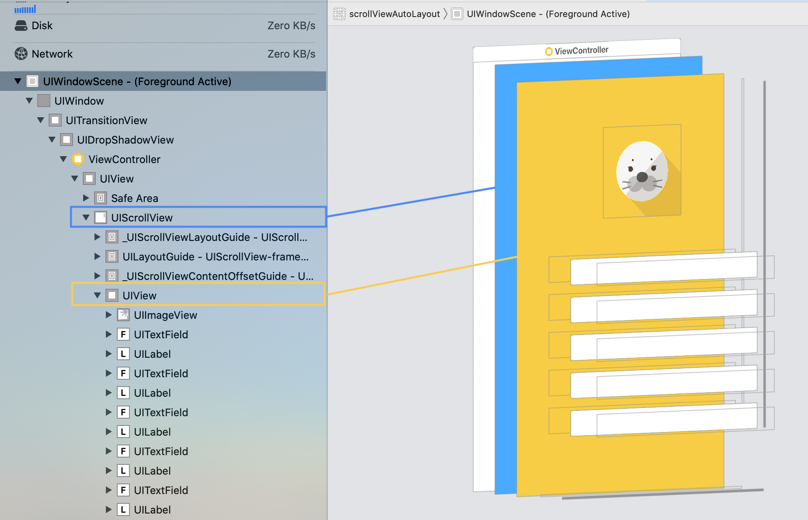

こんにちは、Wataruです。最近ブログの更新が滞りがちになってます。

今回は、Storyboardで、UIScrollViewを設定する際の、AutoLayout設定についてデモを交えて解説します。

基本的な内容ですが、わからないとレイアウトに何時間も費やすことになるので、しっかり理解しておきたい内容です。

## デモ

今回はサインアップの入力フォームを想定し、入力に不備があると、エラーを表示するデモを作成しました([デモ](https://github.com/WataruMaeda/scrollViewAutoLayoutDemo))。


## 基本



まず大事なのが、UIScrollView上に直接ボタンやテキストフィールドを置いてはいけないことです。必ずUIVIew(コンテンツビュー)を起き、その中にボタンやテキストを追加する必要があります。

レイアウトは以下の構成にしてください。

```
UIViewController
  - UIScrollView
    - UIView (contentView)
      - UITextField
      - UIButton
      ...
```

## 実装手順

Storyboard上のScrollViewにコンテンツを追加し、コンテンツ分スクロールするには実装手順があります。

### 1. ScrollView内のコンテンツを作成

まずは、UIScrollView内のコンテンツを作成します。

UIVIewControllerにUIScrollViewを追加し、そのScrollView内にUIVewを追加してください。


AutoLayoutを設定したUIViewを用意

ScrollView内のコンテンツを設定してください。UIViewベースに

### 2. UIViewController上にUIScrollViewを追加

### 3. UIScrollView上に、1のUIViewを追加

### 4. ScrollViewとViewにConstrainを設定

