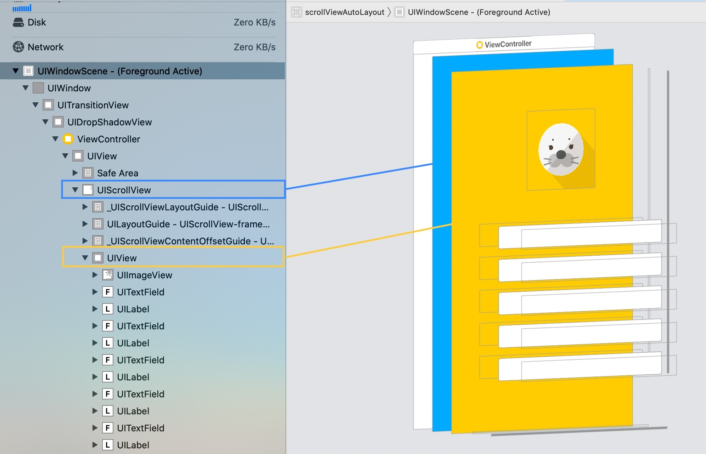
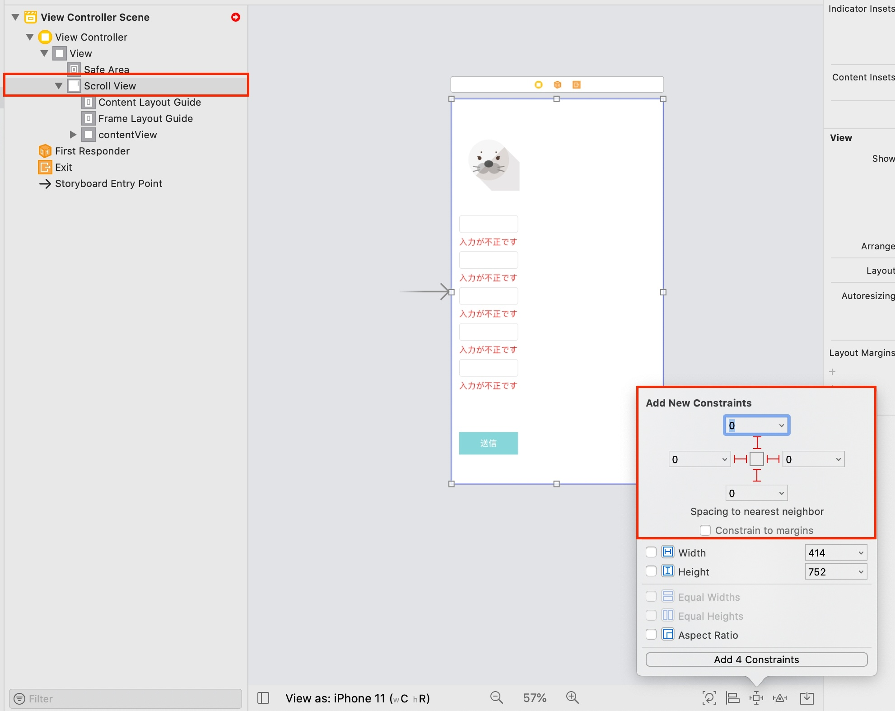

こんにちは、Wataruです。最近ブログの更新が滞りがちになってます。

今回は、スクロールビューのAutoLayout設定に関して、デモを交えて解説しようと思います。基本的な内容ですが、なぜ記事を描こうかと思ったというと、iOS開発を始めたばかりの人はつまる内容だと思うからです。やり方を知らないと何時間も時間を無駄にすることになるので、そういった人を手助けできればと思います。わかればそこまで難しくないので、さっくり理解しておきましょう。

## デモ

今回はサインアップの入力フォームを想定し、入力に不備があると、エラーを表示するデモを作成しました。ソースコードは[こちら](https://github.com/WataruMaeda/scrollViewAutoLayoutDemo)から


## 基本



まず大事なのが、UIScrollView上に直接ボタンやテキストフィールドを置いてはいけないことです。必ずUIVIew(コンテンツビュー)を起き、その中にボタンやテキストを追加する必要があります。

レイアウトは以下の構成にしてください。コンテンツビュー上に、UIエレメントを追加します。もしテキストの文字数によって、コンテンツビューの高さが変わっても、AutoLayoutがうまく働くと、自動でコンテンツサイズが再計算されます。

```
UIViewController
  - UIScrollView
    - UIView (コンテントビュー)
      - UITextField
      - UIButton
      ...
```

## 実装手順

### 1. コンテンツビュー内UIエレメントのコンストレイン設定

まずは、コンテンツビューを作成します。UIView上に、テキストや、ボタンを配置し、コンストレインを設定することでコンテンツビューを作成します。基本的なAutoLayoutの設定になるので実装方法は割愛します。

### 2. スクロールビューのコンストレイン設定



UIViewControllerにスクロールビューを追加してください。そのスクロールビューにコンストレイン(上下左右)を設定します。これにより、スクロールビューのフレームサイズは、親 (UIViewController)と同じになります。

### 3. コンテンツビューのコンストレイン設定


次にコンテンツビューのコンストレイン(左右)を設定します。こちらでは上下のコンストレインは設定しません。理由として、このコンテンツビューはスクロールする必要があるので、もし上下のコンストレインを設定すると、親 (スクロールビュー)のフレームサイズと同じとなり、スクロールしなくなってしまうためです。

### 4. スクロールビューのコンテントサイズ設定


最後に、コンテンツビューが長くなれば、長くなっただけスクロールさせる必要があります。そのためには、コンテンツレイアウトを、コンテンツビューの高さと同じに設定する必要があります。

以上になります。うまくできたでしょうか？　コンストレインの設定がうまくいくと、文字数によってラベルの高さが変わったり、エレメントサイズを動的に変更させたとしても、コンテンツビューサイズ、スクロール幅が自動更新されます。

お疲れ様でした。