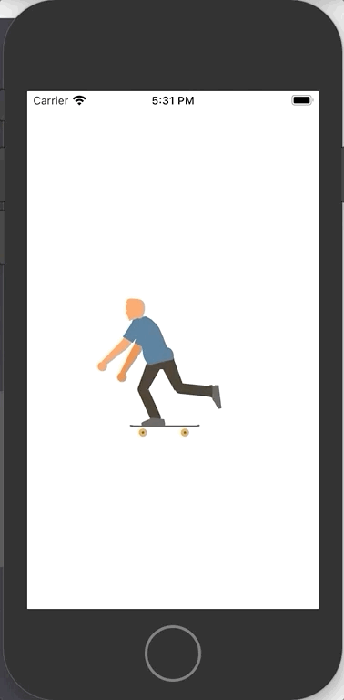
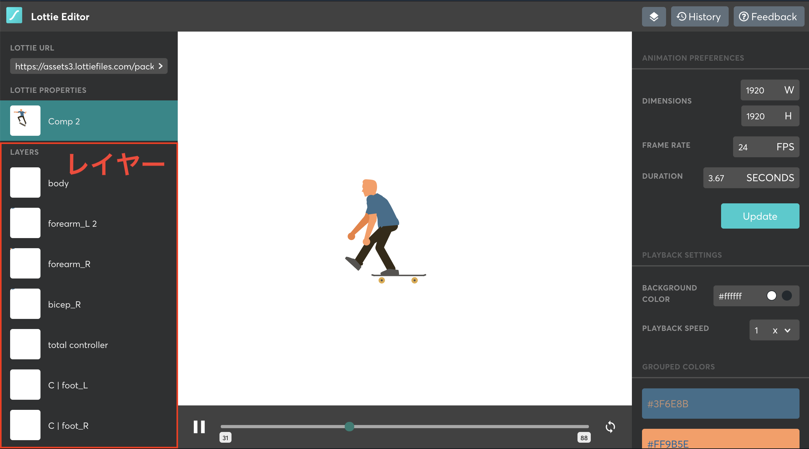
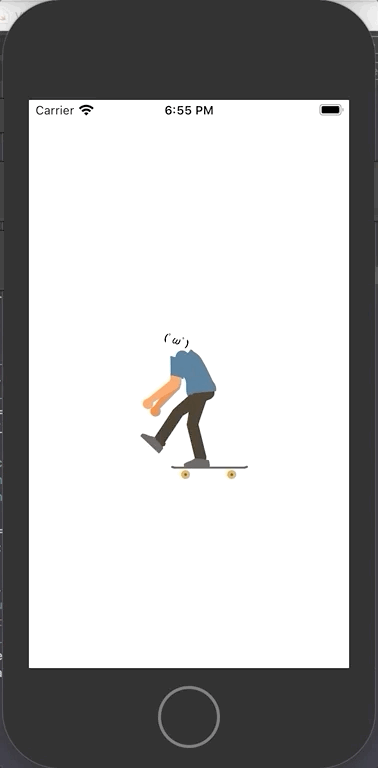

こんにちは、バンクーバー在住のソフトウェアデベロッパー wataru です。

さて、今回 Lottie というライブラリを使い、リッチアニメーションを実装してみるわけなのですが、Lottie とは何か、どう言う仕組みで動いているのか、他のアニメーションライブラリではなくなぜ Lottie なのか等々を纏めていきたいと思います。早速見ていきましょう。

## Lottie とは

Airbnb が開発した、リッチアニメーションを簡単に実装できるアニメーションライブラリです。

Lottie 自体にアニメーションを付与する機能はなく、[Adobe After Effects](https://www.adobe.com/products/aftereffects.html) (ビデオエフェクトソフトウェア)から生成した JSON ファイル(\*のちに Lottie ファイルと呼ぶ)をモバイル、ウェブ上で読み込み、アニメーション表示するためのライブラリです。

要は動画でいうとこのビデオプレイヤー的な役割をするライブラリです。ビデオプレイヤー(Lottie)に好きな動画(Lottie ファイル)を読み込ませることにより、様々なリッチアニメーションを実現することができます。

## なぜ Lottie を選んだのか

Github 上のスター数は 2 万を超えています([こちら](https://github.com/airbnb/lottie-ios))。これだけで十分ライブラリの信憑性はあるのですが、ライブラリの導入のしやすさ、パフォーマンスチューニング、細やかな機能設定、それに複数のプラットフォーム(iOS, Android, React Native, Web...etc)で使える点等々で使用を決めました。ドキュメントは丁寧に纏められているのですが、サンプルが少ないのが少し残念でした。

- [公式ドキュメント](http://airbnb.io/lottie/#/ios)

## インストール

まず、
公式ドキュメントのライブラリ[導入編](http://airbnb.io/lottie/#/ios?id=installing-lottie)を見てみましょう。ライブラリマネーシャーでおなじみ、cocoapods を使用します。

Pod ファイルに以下一文を追加して、*pod install* するだけです。以上で導入完了。

```
pod 'lottie-ios'
```

## 実装

好きなLottie ファイルを[Lottie Files](https://lottiefiles.com/)でから落としてきてください。

僕は[こちら](https://lottiefiles.com/41256-skateboarding)のスケボー兄さんを使用させてもらいます。


ダウンロードした Lottie ファイルをプロジェクトに取り込み、数行のコードを書けば完了です

```swift {numberLines}
import UIKit
// highlight-next-line
import Lottie

class ViewController: UIViewController {
  override func viewDidLoad() {
    super.viewDidLoad()

    // play lottie file
    // highlight-start
    let animationView = AnimationView(name: "41256-skateboarding")
    animationView.frame = view.bounds
    animationView.loopMode = .loop
    animationView.contentMode = .scaleAspectFit
    view.addSubview(animationView)
    animationView.play()
    // highlight-end
  }
}
```

実行するとしてシミュレーター上でアニメーションを確認できました。



## アニメーションレイヤーにサブビューを追加する

Lottieの凄いところは、ただアニメーションを再生するだけでなく、指定のアニメーションレイヤーにサブビューも追加できると言うところです。[ドキュメント](http://airbnb.io/lottie/#/ios?id=adding-subviews)

Lottieアニメーションは複数のアニメーションレイヤーからなり、それぞれのレイヤーが動くことで、リッチアニメーションを実現しています。そのレイヤーにサブビューを追加することで、サブビューをレイヤーの一部としてをアニメーションさせてることができます。

[Lottie Editor](https://lottiefiles.com/editor)で、Lottie Fileのレイヤーを見てみましょう。左側に見えるのがレイヤーです。レイヤー名を指定することで、どのレイヤーに対してサブビューを追加するのかを指定できます。




今回は、スケボー兄さんの顔を置き換えてみましょう。

> Searches for the nearest child layer to the first Keypath and adds the subview to that layer. The subview will move and animate with the child layer. 

ドキュメントにある通り、どのレイヤーにサブビューを追加するかを決めないといけません。今回は顔を置き換えるということで、レイヤー **"head"** にサブビューを追加します。

```swift {numberLines}
import UIKit
import Lottie

class ViewController: UIViewController {
  
  override func viewDidLoad() {
    super.viewDidLoad()
    
    // play lottie file
    let animationView = AnimationView(name: "41256-skateboarding")
    animationView.frame = view.bounds
    animationView.loopMode = .loop
    animationView.contentMode = .scaleAspectFit
    view.addSubview(animationView)
    
    // add label to replace face
    // highlight-start
    let path = AnimationKeypath(keypath: "head")
    let faceSubview = AnimationSubview()
    let faceLabel = UILabel()
    faceLabel.backgroundColor = .white
    faceLabel.frame = CGRect(x: -50, y: -450, width: 200, height: 200)
    faceLabel.text = "(ﾟωﾟ)"
    faceLabel.textAlignment = .center
    faceLabel.layer.cornerRadius = 100
    faceLabel.clipsToBounds = true
    faceLabel.font = UIFont.boldSystemFont(ofSize: 60)
    faceSubview.addSubview(faceLabel)
    animationView.addSubview(faceSubview, forLayerAt: path)
    // highlight-end
    
    animationView.play()
  }
}
```

結果こうなります。



見事に顔が置き換えられ、動きに合わせ、新しい顔の位置、角度まで変わっていますね！

「x, y座標が固定になってるけど、アニメーションのフレームサイズ変われば顔の位置ずれるのでは？」と思った方もいると思います。

僕もそこは気になっていたのですが、その心配はありませんでした。どのフレームサイズでも、顔の位置がずれることはありませんでした。

ユーザーのプロフィール画像を組み込んだアニメーションを作ったり、いろいろなことに応用できると思います。

## Lottie の懸念点

今まで散々Lottieの良い点をかいてきましたが、反対に、僕が問題だと思った点を書きたいと思います。

***「自身のLottieファイルを作る」方法が少ない ***

ことです。前章でお伝えした通り、Lottieファイルは[Adobe After Effects](https://www.adobe.com/products/aftereffects.html)からエクスポートする必要があるのですが、Adobe After Effectsは有償です。一定の無料期間はあるのですが、今後も定期的に使う場合、ライセンスの購入が必須となります。

そこで無料でLottieファイルを作る方法を模索してみました。

1. [Lottie Editor](https://edit.lottiefiles.com/) で既存のLottie Fileを編集
2. [SVG to Lottie](https://lottiefiles.com/svg-to-lottie)より、SVGアニメーションファイルからLottieファイルを作る

Figmaのプラグインもあったのですが、こちらは試せてないです。どなたか良い方法あれば教えてください。


いかがだったでしょうか。今回はLottieを使ったアニメーションを実装してみました。

今後も別のアニメーションライブラリを試してまた記事にしてみる予定です。調べている中で気になったのが、[svgator](https://www.svgator.com/)というSVGアニメーション作成ツールです。こちらは３つのプロジェクトまで無料でつくれます。[Macaw](https://github.com/exyte/Macaw)使って読みこけるのかも試してみたいと思います。

最後まで読んでいただいてありがとうございました。