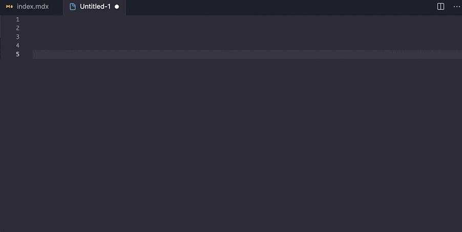

バンクーバーからこんにちは、wataru です。

早速ですが、みなさんはMacを使いやすくするため、どういったアプリを使っていますが？

今回は ***生産性を高めるために入れるべきアプリ*** を紹介します。今回プログラマ向けのアプリもありますが、それ以外の方にも有用なアプリもピックアップしたので、是非ご確認ください。

## [Alfred](https://www.alfredapp.com/)

言わずと知れたランチャーアプリです。Spotlightの類似アプリと思っている人もいるかもしれませんが、おすすめは ***[Powerpack](https://www.alfredapp.com/powerpack/)*** 購入後に使える **Alfred Workflows** です。***アプリにホットキーを割り当てることができます。***

アプリ立ち上げる時、切り替える時、Spotlight, Switcherから切り替えることが多いかも知れません。Alfredを使えば、アプリにホットキーを割り当てることができます。

僕のMacでは、Control + V　で　VSCodeを立ち上げます。Control + Fでフォルダを立ち上げます。ショートカットを用いれば、どれだけアプリを開いていようが関係ないです。すぐに指定のアプリに切り替え、立ち上げることができます。

他にもクリップボード履歴や、スニペット作成、まだまだ便利な機能があるので気になる方ほ確認してみてください。

## [ShiftIt](https://github.com/fikovnik/ShiftIt)

デフォルトの機能でうまく画面分割できないのは非常に不便ですね。 ShiftItはそこを解消してくれる、無料の画面分割アプリです。有料のものではMagnet(マグネット)があるのですが、ShiftItで全然事足ります。

- 4分割
- 縦横2分割
- センター
- 左揃え、右揃え
- 拡大、縮小
- 複数のモニター間の画面の移動

挙動も軽く、十分すぎる機能を有しています。インストール方法、使い方は[こちら](https://pikawaka.com/tips/shiftIt)で詳しく説明してくれているので、是非試してみてください。

## [ColorSnapper2](https://colorsnapper.com/)

モダンなカラーピッカーです。主な使用方法は以下になります。

1. ショートカットよりピッカー起動
1. スクリーンのピクセルをスナップ
1. コピーしたいフォーマットを選択
1. 好きな場所に貼り付け

スナップした色の履歴も確認することができます。デザイナー、フロントエンドデベロッパーの方々が重宝するアプリだと思います。

## [Unclutter](https://unclutterapp.com/)

<iframe width="560" height="315" src="https://www.youtube.com/embed/XVUFqnlD1Lg" frameborder="0" allow="accelerometer; autoplay; clipboard-write; encrypted-media; gyroscope; picture-in-picture" allowfullscreen></iframe>

みなさんは、ちょっとしたメモ書きはどこに残してるのでしょうか? 

僕はunclutterを使っています。どの画面からでも、メモ、ファイル、クリップボードにアクセスできる非常に便利なツールです。

Unclutterのメモエリアは常時、画面上部に隠れているのですが、マウスを当てたり、ショートカットキーより、自由に開閉することができます。

複数の画面からUnclutterのメモエリアにアクセスできるので、アプリ自体を起動したり、閉じたりする必要はなく、メモ書きが非常にスムーズです。

## [Irvue](https://apps.apple.com/app/irvue/id1039633667?mt=12)

みなさんはデスクトップ画像はどのように設定されているでしょうか？

僕はIrvueより、30分おきにデスクトップ画像が切り替わるようにしています。作業時間の目安にもなりますし、何より同じ画像を毎日見るのも飽きるものです。

その点、Irvueは高画質の画像をUnsplashから取ってきています。最新の画像を撮ってくることも可能ですし、自身が好きな画像リスト(チャンネル)の中から自動で画像を切り替えることもできます。

## おわりに

いかがでしたでしょうか？今回は生産性をあげるアプリ５選をピックアップしました。もしおすすめのアプリがあれば是非コメント欄より教えてください。
