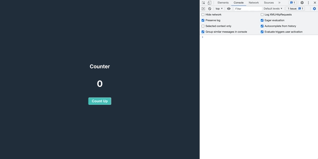
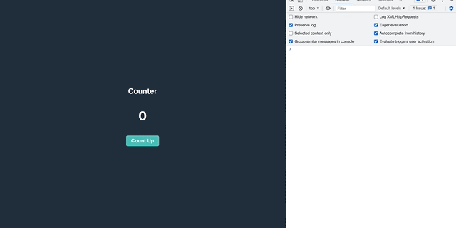
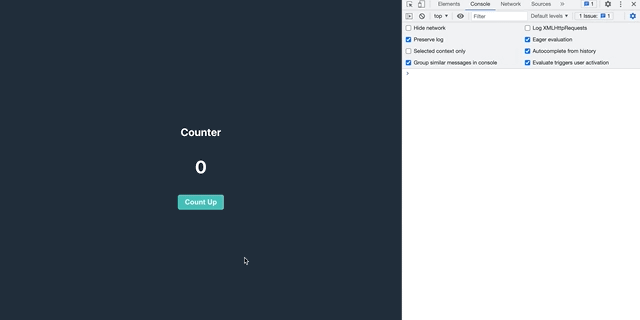

こんにちは、Wataruです。

useMemo, useCallbackはたまに使うけど、いまいち使いどきがわからないことはないでしょうか？あ、レンダーちょっと遅いなとか、ビューがチカチカするなとか、そういった目に見えて不具合ある時のみに使っていましが、理解が曖昧なまま使って使っていました。

今回は、useCallback, useMemo (memo)の使い方を記載します。これらはパフォーマンス向上のために用いられるhooksです。ドキュメント読んだり、記事見たりしたのですが、いまいち腑に落ちないなと思うことが多かったので、理解するにあたり、簡単なカウンターアプリを使い挙動の確認したので、その結果と併せて紹介します。それではみていきましょう。

## なぜ必要?

Reactは、stateの変更すると、ビューを再描写してくれるの便利なフレームワークです。便利な反面、パフォーマンスも考えて実装する必要があります。例えば、多くの入力項目がある画面があったとしましょう。ある項目にテキストを入力すると、入力内容が表示されるます。stateが更新され、stateの変更によって、画面内の全てのビューが再描写されます。この場合、変更すべきは入力のあった項目だけで、その他変更のないビューの再描写は必要ありません。

ビューの再描写のタイミングでは、コンポーネント内のあらゆる関数は破棄され、再度メモリが割り当てられます。再描写の際、更新が必要でないものは、このメモリの破棄->再度割り当てが、必要ないので、useCallback, userMemoを使い、余分な再描写しないようにしましょうということです(=メモ化)。

今回はわかりやすくするため、簡単なカウンターアプリを使っていますが、小さいコンポーネント、関数単位で、useCallback, useMemoの必要性はあまりありません。今回の記事はあくまでhooksの挙動を理解するためのものと考えておいてください。

## useCallback, useMemo(memo)の使い分け

公式ドキュメントの[Hook API Reference](https://ja.reactjs.org/docs/hooks-reference.html)にある通り、

- useCallback ・・・　メモ化された **関数** を返します。
- useMemo　・・・ メモ化された **値** を返します。

少しわかりづらいですが、useCallbackは"関数"自体をメモ化。useMemoは、"結果"をメモ化します。

- memo ・・・　useMemoと同じ。HOC(※1)として使う。

ちょっと何言ってるかわからない。。。と思うので、以下のセクションでカウンターアプリをみて、挙動を確認しましょう。

(※1) ハイオーダーコンポーネント。 他のコンポーネントをラップするReactコンポーネントのこと

## 今回のサンプルコード

ボタンを押下すると、ラベルの数字が1ずつ加算される簡単なカウンターアプリです。手元で実験したい方は、[こちら](https://github.com/WataruMaeda/try-hooks)からプロジェクトをダウンロードし、実験してください。



コンソールを開くと、以下のログがstate変更ごとに表示されていることがわかります。
- 🚀 [Title Label] render
- 😲 [Counter Label] render
- ✅ [Button] render

これはカウントをStateで管理しているため、カウント更新ごとにビューの再描起き、それに併せてラベル、ボタン再描写も行われています。ログは再描写が行われたかどうかの確認のためです。

本来であれば、タイトルと、ボタンの再描写は必要ありません。なぜなら再描写前と比べ変更が必要ないからです。それではhooksを使って不必要な再描写が起きないようメモ化していきましょう。

↓元のコード

```javascript {numberLines}
import React, { useState } from 'react'

function TitleLabel(props) {
  console.log('🚀 [Title Label] render')
  return (
    <span {...props} />
  ) 
}

function CounterLabel(props) {
  console.log('😲 [Counter Label] render')
  return (
    <span {...props} />
  ) 
}

function Button(props) {
  console.log('✅ [Button] render')
  return (
    <button type="button" {...props} />
  )
}

function App() {
  const [count, setCount] = useState(0)
  const countUp = () => setCount(pre => pre + 1)
  return (
    <div>
      <TitleLabel>Counter</TitleLabel>
      <CounterLabel>{count}</CounterLabel>
      <Button onClick={countUp}>
        Count Up
      </Button>
    </div>
  );
}

export default App;
```

## memoを使ってメモ化する

memoはHOCであるため、コンポーネントをラップすることで使うことができます。ですので、サンプルコードのLabel, Buttonをメモ化してみましょう。


```javascript {numberLines}
// import React, { useState } from 'react'
// highlight-start
import React, { useState, memo } from 'react'
// highlight-end

// highlight-start
const TitleLabel = memo(function (props) {
  console.log('🚀 [Title Label] render')
  return (
    <span {...props} />
  ) 
})
// highlight-end
// function TitleLabel(props) {
//   console.log('🚀 [Title Label] render')
//   return (
//     <span {...props} />
//   ) 
// }

// highlight-start
const CounterLabel = memo(function (props) {
  console.log('😲 [Counter Label] render')
  return (
    <span {...props} />
  ) 
})
// highlight-end
// function CounterLabel(props) {
//   console.log('😲 [Counter Label] render')
//   return (
//     <span {...props} />
//   ) 
// }

// highlight-start
const Button = memo(function(props) {
  console.log('✅ [Button] render')
  return (
    <button type="button" {...props} />
  )
})
// highlight-end
// function Button(props) {
//   console.log('✅ [Button] render')
//   return (
//     <button type="button" {...props} />
//   )
// }
```

結果...



- 🚀 [Title Label] render

のログがなくなりましたね。これは前回の描写と比べて変更がなかったので、再描写の必要がなかったと言うことです。一方、

- 😲 [Counter Label] render

は変わらず再描写されています。こちらは、stateで管理しているcountが更新されたため、ビューの再描写が必要になったためです。

- ✅ [Button] render

こちらは再描写されていますね。あれ。。と思った方は次のセクションで解説します。

## なぜボタンのメモ化が行われていないのか

結論から言うと、Buttonに渡している関数が、再描写前と比べ変更があったとReact側が判断しているからです。

関数、Array, object は イコール(===)として判断されません。

```javascript {numberLines}
true === true // true
false === false // true
1 === 1 // true
'a' === 'a' // true

{} === {} // false
[] === [] // false
() => {} === () => {} // false

const z = {}
z === z // true
```

ここからわかることは、再描写のタイミングで、関数も破棄->再生成られていることがわかります。

```javascript
const countUp = () => setCount(pre => pre + 1)
```

ここでuseCallbackの出番です。この関数をメモ化しましょう。

```javascript
// const countUp = () => setCount(pre => pre + 1)
// highlight-start
const countUp = useCallback(() => setCount(pre => pre + 1), [])
// highlight-end
```

結果...



- 😲 [Counter Label] render

のみの表示になりましたね。

以上になります。最後まで読んでいただきありがとうございました。